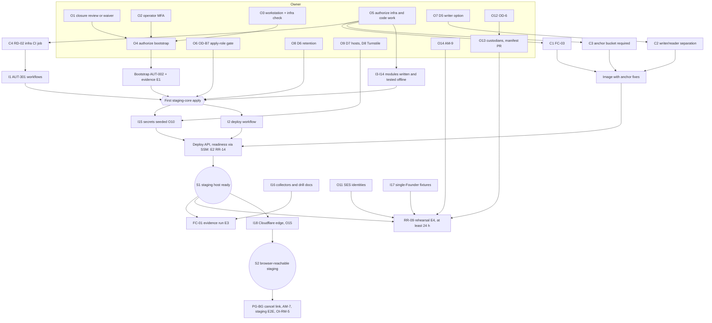

# Staging critical-path plan

- **Date:** 2026-10-03
- **Scope:** the shortest path from today to a working staging environment, the FC-01 evidence run and the RR-09
  rehearsal. No feature work. Nothing here has been started, applied or deployed. Running the bootstrap and creating
  AWS or Cloudflare resources still need the owner's explicit authorization.
- **Inputs reviewed:**
  - the bootstrap code and runbook ([staging-bootstrap.md](../operations/staging-bootstrap.md));
  - the constraints the bootstrap places on later stories: `veda-boundary`, the `veda-gh-*` role policies, and the plan guard `infra/scripts/check-plan.sh`;
  - the placeholders for AUT-101 onward under `infra/`;
  - the API's deployed-environment validation (`api/veda/config.py`), `api/deploy/`, the anchor store (`api/veda/platform/anchor_store.py`) and the break-glass runbook;
  - [P0-release-readiness-report.md](P0-release-readiness-report.md) §§4–7.

## 1. Facts that shape the path

| # | Fact | Consequence |
|---|---|---|
| F1 | Every later stack is applied through `veda-gh-apply` (the only role that may create roles or write trust policies). Owner decision OD-B7 says no workflow may assume `veda-gh-apply` until the trust-writing gap is closed or accepted | **OD-B7 gates every staging stack**, not only AUT-301 |
| F2 | The boundary and the plan guard refuse IAM users, groups, MFA devices and access keys in any Veda stack | Custodian **humans** (OWNER-INPUT-004) are created by the owner, outside Terraform. Discovery then refuses the account until they are added to `allowed_foreign_resources` in `infra/config/staging-account.json` (a reviewed PR) |
| F3 | OWNER-INPUT-004 requires two custodians who are **different humans**. The owner is currently the only collaborator (OD-B5) | A second person must be named before the RR-09 rehearsal can run |
| F4 | The anchor store uses one S3 client with the host's default credentials. It writes without `IfNoneMatch` and reads the current object version (FC-03) | FC-01 evidence needs **code first**: conditional writes, reads by the version id recorded in the manifest, and the writer/reader separation (§3, D5) |
| F5 | `validate_environment` requires an anchor bucket only in production; staging silently falls back to a local directory store (RR-A13) | Code: require `VEDA_ANCHOR_BUCKET` in staging too, or the FC-01 run proves nothing |
| F6 | In staging the API refuses to start without: a JWT key; a Turnstile secret with `VEDA_TURNSTILE_MODE=cloudflare`; four keys of at least 32 random bytes; a real KMS key ARN; SES as provider; secure cookies; public https origins for app, API and site; a trusted proxy CIDR; `VEDA_SNAPSHOT_DIR` on the data volume; STS break-glass identity | Secret seeding (AUT-302), KMS (AUT-102), SES (AUT-111) and the staging host names are needed **before the first start**, even without Cloudflare |
| F7 | The API listens on `127.0.0.1:8000`; `deploy.sh` requires Litestream metrics on `:9090` | The host needs the Litestream bucket. Browser access needs the Cloudflare tunnel. FC-01 and the core RR-09 drill run entirely through Session Manager |
| F8 | Anchors use Object Lock in **COMPLIANCE** mode. Objects cannot be deleted by anyone, root included, until their retention ends, and the bucket cannot be deleted while it holds them | The staging retention period is an irreversible owner decision (D6) |
| F9 | The plan, deploy and evidence roles are denied reads of anchor, Litestream and snapshot objects | FC-01 verification and collection run **on the host** (SSM documents), not from GitHub |
| F10 | The repository is public | Only the local bootstrap procedure is available (runbook §3, Option A) |
| F11 | Terraform modules are tested offline (`terraform test`, the plan guard, checkov, tflint), as the bootstrap was | Module code can be written **in parallel with** the bootstrap; only applies wait for it |

## 2. Every remaining item, by category

| Category | Items |
|---|---|
| **Code work** (needs authorization; no AWS) | C1 FC-03 conditional writes and version-id reads · C2 anchor writer/reader separation per D5, and C3 `VEDA_ANCHOR_BUCKET` required in staging (RR-A13) · C4 RD-02 infra CI job · C5 RR-15 restore fixes · C6 FC-10 approvals card · C7 DC-05 `.pyi` bypass · C8 FC-15 site focus ring · C9 OI-RM-2 Firefox/WebKit legs |
| **Infrastructure work** (code in `infra/`, then an apply) | I1 AUT-301 plan/apply workflows · I2 deploy workflow (image build, ECR push, `veda-deploy`) · I3 AUT-101 network · I4 AUT-102 KMS · I5 AUT-103 buckets (anchor with Object Lock, Litestream, snapshots, artifacts, evidence) · I6 AUT-104 CloudTrail with S3 data events on the anchor bucket · I7 AUT-105 ECR · I8 AUT-106 IAM (host role, anchor writer/reader, custodian roles) · I9 AUT-107 SSM (config parameters, documents, Session Manager logging) · I10 AUT-108 compute (EC2, encrypted data volume, recovery, DLM) · I11 AUT-109 host files (cloud-init, `render-env.sh`, CloudWatch agent, cloudflared unit) · I12 AUT-110 observability (alarms, SNS) · I13 AUT-111 SES · I14 AUT-112 budgets · I15 AUT-302 secret seeding procedure · I16 AUT-401 evidence collectors and drill documents · I17 staging fixtures (`veda-seed-fixtures`, with a single-Founder scenario) · I18 AUT-201…AUT-205 Cloudflare edge |
| **Owner decision / action** | §5 (O1–O16) |
| **Release evidence** | E1 AUT-002 bootstrap evidence · E2 RR-14 deploy evidence · E3 FC-01 evidence (closes FC-01, FC-03, RR-05, IR-03) · E4 RR-09 rehearsal evidence (closes RR-09, IR-06; PG-BG with OWNER-INPUT-004) · E5 RR-06 archival run · E6 the registry gates (RG-*, PG-*, TG-*) |
| **Manual validation** | M1 bootstrap plan review and post-apply checks · M2 human review of every staging plan before apply · M3 custodian sessions with their own MFA · M4 the cancel-link click (PG-BG, needs browser reach) · M5 the FC-01 tamper-drill review · M6 OI-RM-5 screen-reader script |

## 3. Design decisions that must be made before the code is written

| # | Decision | Options | Recommendation |
|---|---|---|---|
| D5 | Anchor writer/reader separation (05 §9.6: "a write-only IAM role distinct from the application's read role") | (a) The anchor job assumes `veda-anchor-writer` (`PutObject` with `If-None-Match` only) through a new `VEDA_ANCHOR_WRITER_ROLE_ARN`; the host role reads. (b) IAM only: the host role may `PutObject` and read, and a bucket policy refuses any write without `If-None-Match` and any delete; no separate role | **(a)**, because it is what 05 §9.6 and 02 §8 specify. (b) needs an architecture amendment |
| D6 | Staging anchor Object Lock retention (COMPLIANCE, irreversible) | Days to keep each anchor in staging | A short period (for example 7 days), so the staging bucket can be retired soon after the rehearsals |
| D7 | Staging host names | For example `app-staging.vedaspaces.com`, `api-staging.vedaspaces.com` | Fix them now: they are configuration even before Cloudflare exists (F6) |
| D8 | Staging Turnstile | A real staging widget (created in the dashboard, or through AUT-203), or Cloudflare's published always-pass test secret until AUT-203 | A real widget: AM-7 needs real keys in staging anyway |

## 4. AWS and Cloudflare resources

### 4.1 AWS (account `813238078849`, ap-south-1)

| Story | Resources | Needed for |
|---|---|---|
| Bootstrap | State bucket `veda-tfstate-813238078849`, KMS `alias/veda-tfstate`, GitHub OIDC provider, `veda-gh-plan`/`-apply`/`-deploy`/`-evidence`, `veda-boundary`, account guardrails, IAM Access Analyzer | Everything |
| AUT-101 | VPC, one private subnet in ap-south-1a (t4g.medium availability is checked by discovery), egress for SSM, ECR, S3, KMS, SES and STS (VPC endpoints or restricted egress, per 02) | Host |
| AUT-102 | Customer-managed keys: application (MFA secret blobs, TG-02), data volume, buckets | Host start (F6) |
| AUT-103 | `veda-stg-anchor-*` (versioning, **Object Lock COMPLIANCE**, D6), `veda-stg-litestream-*`, `veda-stg-snapshots-*`, `veda-stg-artifacts-813238078849`, `veda-evidence-813238078849` | Host start (Litestream), FC-01, evidence |
| AUT-104 | CloudTrail trail (management events, S3 data events on the anchor bucket), trail bucket, log group | FC-01 and RR-09 attribution |
| AUT-105 | ECR `veda-api` (immutable tags, scan on push) | Deploy |
| AUT-106 | `veda-host` role and instance profile; `veda-anchor-writer` (D5); custodian roles `veda-custodian-a`/`-b` trusted only by the named custodian users with MFA (O12, O13); CloudTrail-to-Logs role | Host, FC-01, RR-09 |
| AUT-107 | `/veda/staging/config/*` parameters; SSM documents `veda-deploy`, `veda-collect`, `veda-drill-*`, `veda-seed-fixtures`; Session Manager preferences with session logging | Deploy, evidence, RR-09 |
| AUT-108 | EC2 t4g.medium (Amazon Linux 2023 arm64, IMDSv2), encrypted data volume with `DeleteOnTermination=false`, recovery alarm, DLM snapshots | Host (RG-3, RG-6) |
| AUT-110 | CloudWatch agent configuration, alarms of runbook §9, SNS topic to the owner | FC-01 drill alarm, RG-5 |
| AUT-111 | SES in sandbox: sender identity and verified recipient addresses (no DNS needed in sandbox when individual addresses are verified) | RR-09 notifications |
| AUT-112 | Budget with alert to the owner | Cost guard |
| AUT-302 | SecureString parameters `/veda/staging/app/*`, written by the owner session, never by Terraform | Host start (F6) |

### 4.2 Cloudflare (`vedaspaces.com`)

None of these is needed for FC-01 or the core RR-09 drill. They are needed for a browser-reachable staging (PG-BG cancel link, AM-7 checks, staging E2E, OI-RM-5):

| Story | Resources |
|---|---|
| AUT-201 | Tunnel for the staging host (`cloudflared` on the host, no inbound ports) |
| AUT-202 | DNS records for the D7 host names; for production email later, SES DKIM records. `@`, `www`, MX, the apex SPF and the Google verification record must never change (plan guard) |
| AUT-203 | Turnstile widget for the staging host names (D8) |
| AUT-204 | Pages project or branch for the staging SPA build |
| AUT-205 | WAF and rate-limit rules for the staging host names |

Token: a scoped token for these stories only (Zone:Read, DNS:Edit on `vedaspaces.com`, Cloudflare Tunnel:Edit, Turnstile:Edit, Pages:Edit), held by the owner and used through the `staging-edge` environment. It is never used by the bootstrap (OD-B3).

## 5. Owner actions

| # | Action | Blocks | When |
|---|---|---|---|
| O1 | RD-04: commission the independent review of the pre-bootstrap closure, or record a waiver | Bootstrap | Now |
| O2 | RD-03: virtual MFA device on `bootstrap-operator`; create its access key only on the day of the run, delete it after | Bootstrap | Now |
| O3 | Workstation with Terraform 1.16.4, tflint 0.64.0, checkov, shellcheck, actionlint, `aws` v2, `jq`, `gh`; run `make -C infra check` on a clean clone | Bootstrap | Now |
| O4 | Written authorization and a time window for the bootstrap run | Bootstrap | After O1–O3 |
| O5 | Authorize the staging infrastructure and code work of this plan (§2 code work C1–C4, infrastructure work I1–I17) | All engineering below | Now |
| O6 | OD-B7: close or accept the `veda-gh-apply` trust-writing gap. RR-C proposes an SCP from management account `749251636763` that lets only `veda-gh-apply` write trust policies; RR-A: acknowledge the name-based OIDC trust, or move to a `repository_id` claim | **Every stack apply** (F1) | Before the first apply |
| O7 | D5: anchor writer/reader separation option | C2, I8 | Before C2 |
| O8 | D6: staging Object Lock retention | I5 | Before the AUT-103 apply |
| O9 | D7 and D8: staging host names and Turnstile choice | I15 seeding, I18 | Before the first start |
| O10 | AUT-302: generate and write the staging secrets with an owner session (JWT P-256 key, chain key, recovery, email-hash and action-token keys, Turnstile secret) | First start | After the AUT-107 apply |
| O11 | SES sandbox: confirm the sender address and verify the recipient mailboxes of the Founders and custodians used in the rehearsal | RR-09 notifications | After the AUT-111 apply |
| O12 | OD-6: confirm the custodian credential model (assume-role with MFA per command, runbook §7) | RR-09 | Before I8 custodian roles |
| O13 | OWNER-INPUT-004: name **two different humans** (F3); create their IAM users with MFA in a `veda-break-glass` group with an owner session; add the users to `allowed_foreign_resources` in a reviewed manifest PR; register the custodian-to-human mapping | RR-09, PG-BG | Before the rehearsal |
| O14 | AM-9: choose R, (a) or (b) for break-glass cancellation | Rehearsal step 3 | Before the rehearsal |
| O15 | A Cloudflare token scoped as in §4.2 | Browser-reachable staging | When I18 starts |
| O16 | Budget threshold and alert address (AUT-112); SNS alarm recipients (AUT-110) | I12, I14 | Before those applies |

## 6. Dependency graph

## 7. Shortest paths

| Milestone | Definition | Shortest path (critical items in bold) |
|---|---|---|
| **S1: staging host ready** | API, worker, scheduler and Litestream running on the staging host; `/health/ready` 200 through Session Manager; deployed by the reviewed workflow | **O1–O4 → bootstrap** ‖ **O5 → C4 → I1** ‖ I3–I14 offline ‖ **O6** ‖ O8 → **first apply** → **O10 seeding** → I2 → **deploy** |
| **FC-01 evidence** | Release-readiness report §7.3 completed and filed | S1, with the image built after **C1, C2, C3** (needs O7) + I6 data events + I12 alarm + I16 drill documents → run → evidence PR |
| **RR-09 rehearsal** | Release-readiness report §7.4 completed and filed | S1 + **O12 → O13** (two humans, manifest PR) + O14 + I8 custodian roles + I9 session logging + I13 and O11 SES + I17 fixtures → negative cases, request, approval, cancellation, **24 h** cooling-off → evidence PR |
| S2: browser-reachable staging | Staging SPA and API reachable at the D7 names | S1 + O15 + I18 |

Neither FC-01 nor RR-09 needs Cloudflare (F7, F9). The full PG-BG gate does, for the cancel link. So does every
browser-based staging check.

## 8. Execution order

Steps in the same lane can run in parallel; a step starts only when everything it lists under "after" is done.

| Step | Lane | Action | After | Category |
|---|---|---|---|---|
| 1 | Owner | O1 closure review or waiver; O2 operator MFA; O3 workstation and `make -C infra check`; O5 authorization; O7, O8, O9 decisions | — | Owner |
| 2 | Eng | C4: add `make -C infra check` as a required CI job (RD-02) | O5 | Code |
| 3 | Eng | C1, C2, C3: anchor store conditional writes, version-id reads, writer role per D5, anchor bucket required in staging; tests on both engines with the S3 model | O5, O7 | Code |
| 4 | Eng | I1: AUT-301 plan/apply workflows reusing `check-plan.sh`, digest binding and a credential-free preflight, as `00-bootstrap` does | step 2 | Infrastructure |
| 5 | Eng | I3–I14: write `envs/staging-core` and its modules; offline tests, plan guard, checkov | O5 (O8 for I5) | Infrastructure |
| 6 | Eng | I11, I15–I17: host files, the seeding procedure, SSM drill and collector documents, staging fixtures | O5 | Infrastructure |
| 7 | Owner | O4: run the bootstrap (release-readiness report §7.1); file E1 | O1–O3 | Infrastructure, evidence |
| 8 | Owner | O6: OD-B7 decision; apply the SCP from the management account if chosen (RR-C) | — | Owner |
| 9 | Eng + owner | First `staging-core` plan through `veda-gh-plan`; human review (M2); apply through `veda-gh-apply` | steps 4, 5, 7, 8 | Infrastructure |
| 10 | Owner | O10: seed `/veda/staging/app/*` | step 9, O9 | Owner |
| 11 | Eng | I2: deploy workflow; build the image (with step 3) and deploy; file E2 (RR-14) | steps 3, 9, 10 | Infrastructure, evidence |
| 12 | — | **S1 reached** | step 11 | — |
| 13 | Eng + owner | FC-01 run (§7.3 of the release-readiness report); review the drill (M5); file E3 | step 12, I6, I12, I16 | Evidence, manual |
| 14 | Owner | O12, O13 (two custodians, manifest PR), O14, O11 | — (start early: F3) | Owner |
| 15 | Eng + custodians | RR-09 rehearsal (§7.4), at least 24 h; file E4 | steps 12, 14, I8, I9, I13, I17 | Evidence, manual |
| 16 | Eng + owner | O15, then I18: Cloudflare edge; **S2 reached**; PG-BG cancel link, AM-7 checks, OI-RM-5 | step 12 | Infrastructure, manual |

Not on these paths, but before production: C5 (RR-15, before RG-1 and RG-2), C6–C9, the OWNER-INPUT-001…003
values, the security assessment and SES production access.

## 9. First executable task

**C4 (RD-02): run the infrastructure offline checks in CI as a required check.** It is the first step that needs
neither AWS, nor credentials, nor an owner decision other than the authorization to proceed (O5). It also has to land
before any staging plan or apply workflow (I1) exists. Otherwise the new Terraform would merge without the checks
that the bootstrap code itself had to pass.

The task:
- add an `infra` job to `.github/workflows/ci.yml` that installs the pinned tools and runs `make -C infra check`, with no AWS credentials;
- make it a required status check on `main` with the existing `github-setup.sh` (the owner runs the protection update);
- add a test that fails if the job or the required check disappears.

In parallel, on the owner side: O1, O2 and O3, which are the remaining bootstrap prerequisites.
