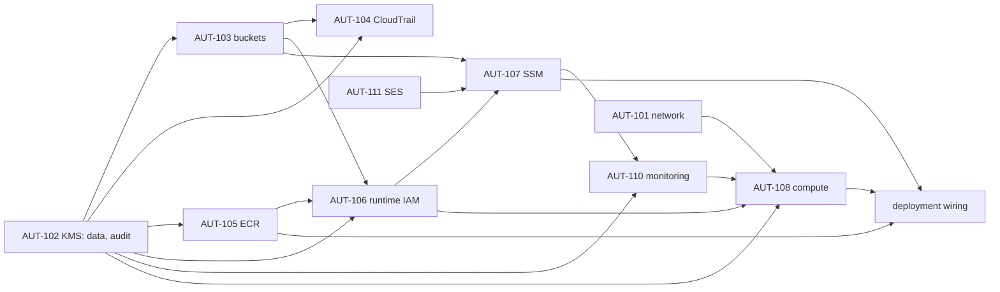

# Consolidated review package: staging platform completion (AUT-102 … AUT-111)

- **For:** one independent integrated review of every module below. Each module gets its own verdict (CERTIFIED,
  CERTIFIED WITH CONDITIONS, NOT CERTIFIED); a finding in one module does not reopen another.
- **Branch:** `infra/staging-platform-completion`, one dependency-ordered commit per module (§2).
- **State:** implementation only. **Nothing is applied, no AWS resource is created, Veda is not deployed and public
  lead intake stays disabled.** Applies stay disabled by the apply gate (OD-B7, N-04-S) and by the decision gate (§3).
- **Base:** `main` after PR #21 (AUT-101 network), AUT-112 (budget) and AUT-301 (plan/apply workflows).
- **Owner decisions of 2026-10-05:** C1 keep the budget alerts (80% and 100% forecast); C2 the bootstrap is re-applied
  before the first AUT-101 apply; C3 VPC flow logs go to S3; C4 the default VPC stays for now.

## 1. Architecture summary

One Graviton host (t4g.small, Amazon Linux 2023) in the AUT-101 public subnet with no inbound access, running the
API, worker, scheduler and Litestream in Docker (02 §12). State lives on an encrypted data volume and replicates to
S3; nightly snapshots and anchors are Object-Locked; every AWS call is audited by CloudTrail; logs and alarms go to
CloudWatch and an SNS topic; email goes through SES in sandbox. The host is managed only through SSM; the image comes
from ECR; configuration comes from SSM parameters; secrets are seeded by the owner (AUT-302), never by Terraform.

## 2. Commits

| # | Commit | AUT | Protected requirements |
|---|---|---|---|
| 1 | KMS | AUT-102 | TG-02 (MFA secrets under a real KMS key), F7 (no cross-account use), region confinement |
| 2 | Buckets and Object Lock; flow logs to S3 (C3) | AUT-103, AUT-101 | OPS-002 (Litestream), RR-14 (snapshots), SEVT-007 and FC-01 (anchors), evidence, F2/F7 (no public or foreign access), N6 |
| 3 | CloudTrail | AUT-104 | F6 (audit cannot be weakened), FC-01 and RR-09 attribution, LOG-* tamper evidence |
| 4 | ECR | AUT-105 | IR-13 and SEC-007 (the tested image is the deployed image), RR-14 (deploy and rollback by tag) |
| 5 | Runtime IAM | AUT-106 | Least privilege (05 §9.6, F1), RR-03 (bounded roles at path `/`), FC-01 (anchors never altered), RR-09 (the host is not a custodian) |
| 6 | SSM | AUT-107 | SEC-005 and PLAT-008 (no secret in code or Git), F6 (staging start configuration), RR-09 (session transcripts) |
| 7 | Monitoring foundations | AUT-110 | LOG-005/006 and 02 §9 alerts, RG-5, RR-14 (snapshot heartbeat), FC-01 (anchor failures), NOTIF-008 (notification failures visible, lead kept), cost (bounded metrics) |
| 8 | Compute and EBS | AUT-108 | ADR-008 (one host), OPS-006/007 (single instance, dedicated encrypted volume, daily snapshots), IMDSv2 (F6), SSM-only access, egress model A, cost (credits capped) |
| 9 | SES | AUT-111 | NOTIF-* (email through SES in staging, F6), NOTIF-008 (a failed email never rolls back a lead), sender reputation (bounce and complaint suppression) |
| 10 | Deployment and integration wiring | AUT-108, AUT-107, AUT-301 follow-up | 02 §12.4 and OPS-004 (single deploy procedure), IR-13 (the scanned image is the deployed image), RR-17 (floors kept: `deploy.sh` unchanged), SEC-005 (secrets only from SSM), public intake disabled |
| 11 | Evidence and runbooks | AUT-401 foundation, all | Evidence without secrets or personal data, locked (RR-* evidence), runbooks for every procedure, cost report, plan proof |

## 3. Decisions

`infra/config/staging-platform.json` holds every platform decision. An entry marked `PROPOSED` is a value the owner
has not yet decided: plans run with it, applies refuse it. **Decision gate:** `stack.sh apply` refuses while any
`infra/config/staging-*.json` section has `"status": "PROPOSED"` (checked after the apply gate, before any AWS
session); a malformed decision file also refuses.

| Section | Status | Content |
|---|---|---|
| `kms` | DECIDED | Two keys (data, audit); yearly rotation; 30-day deletion window |
| `storage` | **PROPOSED** | Lifecycle periods; evidence locked in COMPLIANCE mode for 30 days |
| `cloudtrail` | **PROPOSED** | CloudWatch copy 30 days; S3 data events on anchor and evidence added by the owner session |
| `ecr` | **PROPOSED** | Keep the last 30 tagged images; untagged expire after 7 days |
| `ssm` | **PROPOSED** | D7 host names (`app-staging`, `api-staging`, `staging` .vedaspaces.com); trusted proxy `172.30.0.1/32` (the Compose network gateway, the peer the API sees; Docker address pool `172.30.0.0/16`, AUT-001 host design); Litestream 7 days; transcripts 90 days; sessions 20 idle / 60 total minutes |
| `monitoring` | **PROPOSED** | Logs 30 days; 5xx ≥ 5 per 5 minutes; CPU 80 %, memory 85 %, data disk 80 %, root disk 85 % |
| `compute` | **PROPOSED** | t4g.small (N2), credits capped; 12 GB root, 20 GB data (gp3); 7 daily snapshots; AMI pinned after the first plan |
| `ses` | **PROPOSED** | Sender `no-reply@staging.vedaspaces.com` (subdomain; DKIM by AUT-202); sandbox with the owner's address; bounce-rate alarm above 5 % |
| `deploy` | DECIDED | **`enabled: false`**: Veda is not deployed; public intake disabled (owner, 2026-10-05). 12-deploy refuses until the owner sets it true |
| `anchor_retention` | **PROPOSED** | D6: the application locks each anchor for **3650 days** in COMPLIANCE mode (`anchor_store.py`); accept, or change the application first |

## 4. Modules

### 4.1 AUT-102 KMS (`modules/kms`)

| Item | Implementation |
|---|---|
| Keys | `alias/veda-stg-data`: MFA secret blobs (`VEDA_KMS_KEY_ARN`, TG-02), EBS, Litestream/snapshot/anchor/artifact buckets, ECR. `alias/veda-stg-audit`: CloudTrail, logs and evidence buckets, CloudWatch Logs, the alarm topic |
| Why two, not three | One application key and one storage key would cost 1 USD/month more; the host needs both anyway. Duty separation is kept where it matters: audit data (trail, logs, evidence) is under a key the application does not use for its data |
| Shape | Symmetric `ENCRYPT_DECRYPT`, single-region, rotation every 365 days, 30-day deletion window, `prevent_destroy` |
| Policy | Account root (IAM decides use inside the account); **Deny `kms:*` to any caller outside the account** (`kms:CallerAccount`, AWS service principals excepted); audit key only: CloudWatch Logs for `/veda/staging/*` log groups (encryption context), CloudTrail for the `veda-stg-trail` trail (source ARN and context), log delivery for flow logs (source account and ARN), CloudWatch alarms for the topic (source account) |
| Plan guard | Refuses a key without rotation, a deletion window under 30 days, multi-region, asymmetric or HMAC keys, a lockout-check bypass, an unknown or default policy, a policy without the cross-account Deny, any Allow to another account; replica, external and custom-store keys, a separate `aws_kms_key_policy`, an alias outside `alias/veda-*` |
| Tests | `modules/kms`: 4 (shape and rotation; cross-account Deny; audit-key services bound by conditions; short window refused). `run.sh`: 15 |

### 4.2 AUT-103 buckets and Object Lock (`modules/storage`)

| Bucket | Key | Lock | Lifecycle (PROPOSED) | Writers |
|---|---|---|---|---|
| `veda-stg-litestream-<acct>` | data | — | noncurrent versions 7 days | Host (Litestream) |
| `veda-stg-snapshots-<acct>` | data | Enabled; the application locks each snapshot 35 days (COMPLIANCE) | expire after 42 days | Host (nightly snapshot) |
| `veda-stg-anchor-<acct>` | data | Enabled; the application locks each anchor **3650 days** (COMPLIANCE) | none | Host (chain anchors) |
| `veda-stg-artifacts-<acct>` | data | — | expire 90 days, noncurrent 30 | `veda-gh-deploy` (bundles) |
| `veda-evidence-<acct>` | audit | **Default COMPLIANCE 30 days** | none | `veda-gh-evidence`, the collector on the host |
| `veda-stg-logs-<acct>` | audit | — | `cloudtrail/` 90 days, `vpc-flow/` 30 days | CloudTrail (the Veda trail), VPC flow-log delivery |

- **Every bucket:** SSE-KMS with a bucket key; versioning; all four public access blocks; `BucketOwnerEnforced`;
  incomplete uploads aborted after 7 days; `prevent_destroy`; a policy that **denies plain HTTP** and **denies every
  principal of another account** (AWS services excepted, each bound by its own statement).
- **Snapshots and anchors:** the policy denies any write without an Object Lock mode, and every delete.
- **Logs:** CloudTrail may write `cloudtrail/AWSLogs/<acct>/` only for the Veda trail (source ARN); flow-log delivery
  may write `vpc-flow/AWSLogs/<acct>/` only for this account's log sources.
- **Names are the bootstrap's:** the deploy role writes only artifacts, the evidence role only evidence; the plan,
  deploy and evidence roles cannot read Litestream, snapshot or anchor objects (`deny_data_reads`).
- **D6, anchor retention (owner decision):** the anchor writer in the application sets a 10-year COMPLIANCE lock
  (`api/veda/platform/anchor_store.py`, `RETENTION`). In staging every anchor, and the bucket, then lives ten years;
  no one, the root user included, can delete them. The infrastructure cannot shorten it. Options: accept it, or a
  reviewed application change making the retention configurable before the first anchor is written.

**AUT-101 change in this commit (owner decision C3):** VPC flow logs go to the logs bucket (`vpc-flow/`, plain text,
hourly partitions) instead of CloudWatch Logs. The flow-log role, its policy and the log group are gone (network: 27
resources), and **the bootstrap line letting `veda-gh-apply` pass roles to `vpc-flow-logs.amazonaws.com` is removed**:
nothing passes a role to flow logs any more. The bootstrap code is again exactly what was applied on 2026-10-04, so the
re-apply of C2 would plan **no changes**; it stays in the apply sequence only as a verification step.

**Plan guard:** every bucket created with a name (not an unknown id) and, in the same plan and naming it, all four
public access blocks, `BucketOwnerEnforced`, versioning, SSE-KMS and a TLS-only policy; refused: bucket ACLs, a block
with a setting off, other ownership, suspended versioning, SSE-S3, a GOVERNANCE or over-a-year default lock,
replication, website, CORS, access points, Multi-Region Access Points and Transfer Acceleration (the last two bypass
the S3 endpoint policy, AUT-101 review m6).

**Tests:** `modules/storage`: 7 (the six bootstrap names; locks; private, encrypted, versioned; TLS-only and
account-only policies with each statement on its own bucket; evidence lock; GOVERNANCE, early snapshot expiry and
foreign names refused). `run.sh`: 30, starting from a real sandboxed plan of the storage module (each check removes or
changes one thing), plus the decision gate (committed decisions refuse; recorded decisions pass; malformed file
refuses).

### 4.3 AUT-104 CloudTrail (`modules/cloudtrail`)

| Item | Implementation |
|---|---|
| Trail | `veda-stg-trail`: multi-region, global service events, **log-file validation**, logging on, audit key; S3 copy in the logs bucket under `cloudtrail/` (kept per `storage.logs_cloudtrail_expire_days`); `prevent_destroy` |
| CloudWatch copy | `/veda/staging/cloudtrail`, audit key, 30 days; delivered by `veda-stg-cloudtrail-logs` (bounded, assumable by CloudTrail only for this trail, writes only that group's streams) |
| Tampering metric | `Veda/Audit AuditTampering`: StopLogging, DeleteTrail, UpdateTrail, Put*Selectors; ScheduleKeyDeletion, DisableKey, PutKeyPolicy; PutBucketPolicy, DeleteBucketPolicy, Put/DeleteBucketPublicAccessBlock, PutObjectLockConfiguration. Alarm in AUT-110. Delivery failure: AWS/Logs `IncomingLogEvents` on the group (alarm in AUT-110) |
| Boundary interplay | `veda-boundary` denies every role `StopLogging`, `DeleteTrail`, `UpdateTrail` and `Put*Selectors`. The trail is therefore created with management events only and can never be stopped or re-scoped by a workflow. **Any later change to the trail is an owner-session task.** The S3 data events on the anchor and evidence buckets (FC-01, RR-09) are added once by the owner session after the first apply (runbook) |
| Plan guard | Refuses a trail that is single-region, omits global events or log-file validation, is created with logging off, has no KMS key, writes outside a `veda-*` bucket, or sets any selector; CloudTrail Lake data stores and channels; a log group outside `/veda/`, without a KMS key or kept forever |
| Tests | `modules/cloudtrail`: 3 (trail settings and no selectors; CloudWatch copy and bounded delivery role, all values visible at plan time; tampering pattern). `run.sh`: 16, from a real sandboxed plan of the module |

### 4.4 AUT-105 ECR (`modules/ecr`)

| Item | Implementation |
|---|---|
| Repository | `veda-api`, the only repository the bootstrap's deploy role may push to; `IMMUTABLE` tags (a release tag always names one digest); scan on push (basic scanning, no charge); encrypted with the data key; `force_delete = false`; `prevent_destroy`; **no repository policy**, so no principal of another account can pull or push |
| Lifecycle | Untagged images expire after 7 days; the last 30 tagged images are kept (rollback to N-1 and to the release floor of `deploy.sh`) |
| Other images | Litestream and cloudflared stay on Docker Hub, pinned by digest in `docker-compose.yml` and the host setup; mirroring them would need a bootstrap change to the deploy role |
| Plan guard | Refuses a repository outside `veda-*`, with mutable tags, without scan on push or KMS, or force-deletable; any public repository, replication, pull-through cache, registry policy or creation template; a repository policy admitting another account (existing F7 rule) |
| Tests | `modules/ecr`: 4 (immutable, scanned, encrypted; lifecycle; another name and a too-short history refused). `run.sh`: 13, from a real sandboxed plan of the module, including the name the bootstrap scopes the deploy role to |

### 4.5 AUT-106 runtime IAM (`modules/runtime-iam`)

| Item | Implementation |
|---|---|
| Identity | Role and instance profile `veda-stg-host`, path `/`, bounded by `veda-boundary`, assumable by EC2 only |
| AWS managed | `AmazonSSMManagedInstanceCore` only (Session Manager, Run Command); the plan guard allow-lists it |
| Customer policy `veda-stg-host-runtime` | ECR login and pull on `veda-api`; Litestream get/put/delete; snapshots and anchors get/put with retention (no delete); artifacts get; evidence put; list on those five buckets; data key encrypt/decrypt/generate (MFA secrets used directly, `VEDA_KMS_KEY_ARN`); audit key only through S3 (`kms:ViaService`); write its own `/veda/staging/*` log groups; `PutMetricData` only in `Veda/*` and `CWAgent`; read `/veda/staging/*` parameters |
| Explicit Deny | IAM, Organizations, account, `sts:AssumeRole*`, CloudTrail, key creation/deletion/disable/policy/grants, bucket configuration and ACLs and locks, legal holds, governance bypass, every EC2 change, SSM writes/commands/sessions/documents, log-group retention and keys and filters, image pushes and deletes, alarm changes, SNS, SES identity administration |
| Reviewable | Keys are matched by alias (`kms:ResourceAliases`) and the repository ARN is built from its name, so **the whole policy is known at plan time**; the guard now refuses any Veda IAM policy unknown at plan time |
| D5 (open) | The writer/reader separation of anchors is not implemented: the application has no `VEDA_ANCHOR_WRITER_ROLE_ARN` yet (critical-path C2). The bucket policy refuses unlocked writes and every delete, so the host can add anchors but never change or remove one |
| Not here | Custodian roles (`veda-custodian-a/-b`): they need two named humans (OWNER-INPUT-004, O12, O13) and stay out of this workstream |
| Plan guard | AWS managed policies only from the reviewed list (SSM core, DLM service role, and the bootstrap's ReadOnlyAccess and SecurityAudit); no Allow on `*` or a whole service (`<service>:*`) in any Veda policy except the bootstrap's `veda-gh-*` policies and the `veda-boundary` ceiling; no Veda IAM policy unknown at plan time |
| Tests | `modules/runtime-iam`: 6 (bounded role and profile; every Allow names its resources, no whole-service Allow, namespaces, keys by alias; no delete outside Litestream; the explicit Deny; SES only as the staging sender; no SES before AUT-111). `run.sh`: 13, from a real sandboxed plan |

### 4.6 AUT-107 SSM (`modules/ssm`)

| Item | Implementation |
|---|---|
| Configuration | 23 non-secret `String` parameters `/veda/staging/config/<NAME>`, one per environment variable the API, worker, scheduler and Litestream read: environment, region, KMS provider and **the data key alias ARN** (`VEDA_KMS_KEY_ARN`, accepted by the application's `_KMS_ARN` pattern and known at plan time), database URL and snapshot directory on the data volume, snapshot and anchor buckets, Litestream bucket/region/retention, SES as provider, Cloudflare Turnstile mode, secure cookies, rate limits, STS break-glass identity, trusted proxy, and the D7 origins. Each value satisfies `validate_environment` for staging; the sender and configuration set are added by AUT-111 |
| Secrets | **Never Terraform, never Git.** The owner seeds `SecureString` parameters under `/veda/staging/app/` (AUT-302): `VEDA_JWT_PRIVATE_KEY_PEM`, `VEDA_JWT_KID`, `VEDA_CHAIN_KEY`, `VEDA_CHAIN_KEY_LABEL`, `VEDA_RECOVERY_CODE_HMAC_KEY`, `VEDA_EMAIL_HASH_HMAC_KEY`, `VEDA_ACTION_TOKEN_KEY`, `VEDA_TURNSTILE_SECRET`. The plan, deploy and evidence roles are denied reads of `app/*` by the bootstrap; the host reads both paths. The module's validation refuses a secret-looking name in the configuration map |
| Session Manager | The account preferences document `SSM-SessionManagerRunShell`: transcripts streamed to `/veda/staging/ssm-sessions` (audit key, 90 days), session data encrypted with the data key, sessions end after 20 idle minutes and 60 minutes in all, no run-as |
| Host access to it | `logs:DescribeLogGroups` added to the runtime role (Session Manager checks its group exists); reading parameters was already there (AUT-106) |
| Plan guard | Refuses any `SecureString` parameter, any parameter outside `/veda/staging/` or under `app/`; any document other than `veda-*` or the preferences, of a type other than Command or Session, or shared with another account; preferences without encrypted CloudWatch transcripts or with run-as; associations, hybrid activations, maintenance windows, patch baselines and service settings |
| Tests | `modules/ssm`: 4 (plain text under `config/`; transcripts encrypted and sessions bounded; a secret refused; another path refused). `run.sh`: 18, from a real sandboxed plan |
| Scanner notes | checkov CKV2_AWS_34 ("SSM parameter should be encrypted") is skipped inline on the configuration parameters: they are non-secret by design and the guard refuses SecureString there. The secret scanner read the parameter *names* in the plan fixture (`/veda/staging/config/LITESTREAM_BUCKET`, …) as high-entropy strings: 9 entries of `infra/tests/fixtures/aut107-ssm-plan.json` are recorded in `.secrets.baseline` (reviewed false positives; no value) |

### 4.7 AUT-110 monitoring (`modules/monitoring`)

| Item | Implementation |
|---|---|
| Logs | `/veda/staging/app` (container output through Docker's `awslogs` driver, configured on the host) and `/veda/staging/host` (CloudWatch agent: system log, cloud-init, `/var/log/veda/*.log`); audit key; 30 days. With `/veda/staging/cloudtrail` (AUT-104) and `/veda/staging/ssm-sessions` (AUT-107), every log group is under `/veda/staging`, encrypted and expiring |
| Metrics | **A fixed set of log metric filters, not EMF.** The application writes CloudWatch Embedded Metric Format, but its request metrics carry `Route` × `StatusClass` dimensions: every combination would be a billed custom metric (0.30 USD each), enough to exceed the budget. Docker ships the logs as plain JSON, and 7 filters (`Veda/App`) read them: `ServerErrors` (request status ≥ 500), `LeadIntakeFailures` (`/api/v1/public/leads` ≥ 500), `NotificationFailures` (`outbox_handler_failed*`), `OutboxDead`, `ScheduledJobFailed`, `SnapshotCompleted`, `ChainAnchorFailed`. Host: CWAgent memory and two disks, `Veda/Host HealthReady` (AUT-108). Total custom metrics: 12 with the host |
| Alarms | 9 now: 5xx, lead-intake failures, notification failures, dead outbox events, scheduled-job failures, **snapshot missing for 24 h** (silence alarms), chain-anchor failures, audit tampering (AUT-104), **trail delivery** (no events reached the trail group for an hour; silence alarms). 6 more with the host (AUT-108): status check, CPU, memory, data disk, root disk, **API health** (silence alarms). SES alarms come with AUT-111 |
| Notification path | `veda-stg-alarms` topic, audit key; its policy admits only CloudWatch of this account to publish (principals of the account act through IAM); every alarm action is the topic ARN built from its name, so the guard checks it at plan time; the owner's address by email (the `BUDGET_ALERT_EMAIL` secret, sensitive in the plan; AWS sends one confirmation link); the queue `veda-stg-alarm-capture` (SQS-managed encryption, 1 day) that the bootstrap's deploy role reads during drills |
| Dashboard | `veda-stg-overview`: every alarm, the application counters, the latest API errors (Logs Insights widget) |
| Agent configuration | SSM parameter `/veda/staging/cloudwatch-agent` (not under `config/`, so it is not rendered into the application environment) |
| Plan guard | Refuses an unencrypted topic; any subscription other than email or an SQS queue of the account; an unencrypted queue; an alarm action that is not an SNS topic of the account in Mumbai (no EC2 stop or terminate actions); log subscription filters, log destinations and deliveries, metric streams and cross-account observability links |
| Tests | `modules/monitoring`: 6 (logs encrypted and expiring; a bounded set of filters; alarms on the encrypted topic, silence alarms, publish policy, drill queue; no host alarm before the host; host alarms with it; another prefix refused). `run.sh`: 16, from a real sandboxed plan, including that the plan text shows the subscription address only as `(sensitive value)` |

### 4.8 AUT-108 compute and EBS (`modules/compute`)

| Item | Implementation |
|---|---|
| Host | `veda-stg-host`: t4g.small (N2), Amazon Linux 2023 arm64 (latest at the first plan, then pinned in `compute.ami_id`; AMI and boot-script changes are ignored, so they can never replace the host); the AUT-101 subnet and no-inbound security group; its own public IPv4 (egress model A); instance profile `veda-stg-host` (AUT-106) |
| Hardening | **IMDSv2 required**, hop limit 2 (containers reach the role; the account default is the same, guardrails); **no key pair** (SSM only; the guard refuses one); **termination protection**; detailed monitoring off (paid); **burst credits capped (`standard`)**, so a runaway process slows down instead of adding cost; EC2 **automatic recovery** on system-check failure |
| Volumes | Root 12 GB gp3 and data 20 GB gp3, both encrypted with the data key. The data volume (`/var/lib/veda`: SQLite, WAL, local snapshots) is a separate resource with `prevent_destroy`, never deleted with the instance (OPS-007) |
| Snapshots | DLM policy, daily at 02:00 IST, 7 kept, on volumes tagged `veda-backup=daily`; role `veda-stg-dlm` (bounded, assumable by DLM for this account only, AWS managed `AWSDataLifecycleManagerServiceRole`, allow-listed). Backups are threefold: Litestream (continuous), the nightly Object-Locked snapshot (application), and the EBS snapshot (DLM) |
| Boot script | Installs Docker and the CloudWatch agent, and points Docker's logs at `/veda/staging/app` (`awslogs`). No secret; no mount; no application start. The deploy document (§4.10) mounts the volume, installs the pinned Compose plugin, renders the configuration and starts the containers |
| Host alarms | Now on (AUT-110): status check, CPU, memory, data disk, root disk, API health heartbeat (a known boolean enables them: the instance id is unknown until apply) |
| No foreign dependency | Nothing references Aurion or swing-trader-vm; a check asserts no planned resource does |
| Plan guard | Refuses an instance without IMDSv2 required, with an unencrypted root or inline volume, a key pair, or source/destination checking off (a NAT host would break model A); an unencrypted EBS volume; key pairs and serial-console access; snapshot schedules that copy across regions or share snapshots |
| Tests | `modules/compute`: 6 (hardened host; encrypted and kept volumes, daily snapshots; boot script without secrets; bounded DLM role; pinned AMI wins; other instance types refused). `run.sh`: 16, from a real sandboxed plan |

### 4.9 AUT-111 SES (`modules/ses`)

| Item | Implementation |
|---|---|
| Sender | Domain identity `staging.vedaspaces.com`, Easy DKIM 2048-bit. A **subdomain**, so the apex records (SPF, MX, Google verification) are never touched; the three DKIM CNAMEs (`module.ses` output `dkim_tokens`) are published by AUT-202 in Cloudflare. Until then SES reports the identity pending and refuses to send |
| Sandbox | The account stays in the SES sandbox: it sends only to verified addresses. The owner's address (the `BUDGET_ALERT_EMAIL` secret, sensitive in the plan) is verified as a recipient; AWS mails one verification link. Rehearsal recipients are added the same way (O11). Production access is an owner request to AWS, not Terraform |
| Configuration set | `veda-stg`: TLS required to the receiving server; reputation metrics; **suppression of bounces and complaints** (a suppressed address is not sent to again) |
| Failure tracking | Alarms on the free account metrics `AWS/SES` `Reputation.BounceRate` (above 5 %) and `Reject`; application-side, `NotificationFailures` and `OutboxDead` (AUT-110) |
| Failure isolation | The application sends after commit through the outbox; a provider failure marks the event FAILED and retries, and **never rolls back the lead** (NOTIF-008, `api/tests/integration/test_leads.py`); the check is part of `run.sh` |
| Wiring | The host may send only from `no-reply@staging.vedaspaces.com` through the identity and the configuration set (AUT-106 `ses:FromAddress`); the application gets `VEDA_EMAIL_SENDER` and `VEDA_SES_CONFIGURATION_SET` (AUT-107) |
| Plan guard | Refuses inbound email (receipt rules and sets, filters), dedicated IPs and Virtual Deliverability Manager (cost), a configuration set without bounce and complaint suppression or without required TLS, and the apex domain as an identity |
| Tests | `modules/ses`: 4 (subdomain with DKIM; suppression, TLS, reputation; failure alarms; apex refused). `run.sh`: 14, from a real sandboxed plan, including the host's From-address condition and the application's NOTIF-008 test |

### 4.10 Deployment and integration wiring

| Piece | Implementation |
|---|---|
| `12-deploy.yml` | **Manual, from `main` only, disabled.** A preflight job with no environment, secret or token refuses unless the apply gates are decided (`stack.sh gate`), no owner decision is PROPOSED (`stack.sh decisions`, new) and `deploy.enabled` is true (**false**). The deploy job runs in the `staging` environment (reviewer), proves its approval and the environments' protection before any AWS session, then assumes `veda-gh-deploy` through OIDC (`oidc-session.sh` now accepts the deploy and evidence roles); no stored secret; actions pinned; checkouts keep no credentials |
| `infra/scripts/deploy.sh` | Requires a `veda-gh-deploy` session confined to Mumbai and a tag equal to the commit. Builds the image (arm64) from this commit, pushes `veda-api:<tag>` (immutable), reads the digest, **waits for the scan and refuses HIGH or CRITICAL findings**, uploads the bundle (`git archive` of `api/deploy` and `infra/host`: what is committed) with its SHA-256 (an existing bundle for the tag must be the same bytes), runs `veda-deploy` on the instance tagged `project=veda-spaces, env=staging`, waits, prints the result, fails unless `Success` |
| `veda-deploy` (SSM, `modules/deploy`) | **Known at plan time** (the data device `/dev/sdf` and the repository URL are built from constants), so the reviewer reads every command. Parameters accept only a tag, a digest and a SHA-256 (patterns refuse anything else). Steps: download the bundle, **verify its SHA-256**, install the host scripts from it, `host-setup.sh`, `render-env.sh`, ECR login, **pull by digest**, tag `veda-api:<tag>`, run the unchanged `api/deploy/deploy.sh` (floors, snapshot, quiesce, expand-only migration, readiness gate, resume) |
| Host scripts (`infra/host`) | `host-setup.sh` (mount the attachment device, never the root disk, format only an empty volume, pinned Compose v5.6.0 by SHA-256, CloudWatch agent from SSM, health timer); `render-env.sh` (`/etc/veda/api.env` 0600 from SSM; **refuses while any of the 8 secrets is not seeded**; keeps a declared `VEDA_SCHEMA_AHEAD_ACCEPTED`); `health.sh` (heartbeat) |
| Docker | Address pool `172.30.0.0/16` (Compose gateway `172.30.0.1` = trusted proxy) and non-blocking `awslogs` to `/veda/staging/app` (boot script, AUT-108) |
| KMS (AUT-102 change) | The artifacts bucket (data key) and evidence bucket (audit key) are SSE-KMS, and the bootstrap's deploy and evidence roles have no KMS permission. Two key-policy statements grant exactly `veda-gh-deploy` (data key) and `veda-gh-evidence` (audit key) `GenerateDataKey`/`Decrypt`, **only through S3 and only for their bucket** (encryption context). No bootstrap change |
| Container startup, health, readiness | Unchanged application behaviour: `deploy.sh` waits for `/health/ready` with the expected migrations state; restart policy `unless-stopped` (`docker-compose.yml`); the heartbeat and the `api-health` alarm watch it afterwards |
| Not deployed | `deploy.enabled` is false; no tunnel, no DNS (AUT-201/202 out of scope): **no public path to the API exists, so public intake stays disabled** |
| Tests | `modules/deploy`: 4. `run.sh`: 36: workflow contract (manual only, gates first, no credentials in the preflight, `staging` environment, approval before the session, deploy role, no secrets, pinned, no persisted credentials, deploy disabled), `oidc-session` roles, `stack.sh decisions`, `deploy.sh` offline with stub AWS and Docker (success path with the exact `send-command`; HIGH findings refused before any upload; wrong role; tag not the commit; a different existing bundle; a failed command), the document's verification and parameter patterns, the host scripts' secret check, pinned Compose, format-only-empty, no secret in the scripts |

### 4.11 Evidence and runbooks

| Piece | Implementation |
|---|---|
| `veda-collect` (SSM, `modules/deploy`) | Run by the bootstrap's `veda-gh-evidence` on the tagged host only. Records facts: versions, image digests, containers, readiness and schema state (read inside the API container), listening sockets, the data mount, disk, timers, the deploy-log tail; a `MANIFEST.sha256`; the tarball goes to `veda-evidence-<acct>/host/<date>/<instance>/` (COMPLIANCE-locked). Never reads `/etc/veda/api.env`; the label parameter accepts `[a-z0-9-]` only; the only `{{ }}` in the document is that parameter |
| `13-evidence.yml` and `collect-evidence.sh` | Manual, main only; credential-free preflight (apply gates, recorded decisions); `staging-evidence` environment, approval proven before the session; `veda-gh-evidence` through OIDC; prints `evidence s3://… sha256 …` for the summary in `docs/release-evidence/` |
| Runbooks | [staging-platform-runbooks.md](../../operations/staging-platform-runbooks.md): gates; deployment and rollback; backup and recovery (three layers, host rebuild); monitoring (every alarm, first action, drill); SES readiness; evidence; owner-session steps (bootstrap verification C2, CloudTrail data events, secrets AUT-302, pins); **staging apply sequence**; **end-to-end lead-flow validation plan** |
| Cost report | [STAGING-PLATFORM-cost-report.md](STAGING-PLATFORM-cost-report.md) |
| Plan proof | [STAGING-PLATFORM-plan-proof.md](STAGING-PLATFORM-plan-proof.md) |
| Tests | `modules/deploy`: 5 (with the collector). `run.sh`: 15: workflow contract, `collect-evidence.sh` offline (success; label injection refused; wrong role; failed command; no evidence object), the collector never reads the environment, the runbooks cover the eight procedures |

## 5. Validation (consolidated)

All offline; nothing reached AWS.

| Check | Result |
|---|---|
| `terraform validate` | bootstrap and staging-core valid |
| `terraform test` | bootstrap 33; staging-core 8; modules: network 14, kms 4, storage 7, cloudtrail 3, ecr 4, runtime-iam 6, ssm 4, monitoring 6, compute 6, ses 4, deploy 5 (**104**) |
| `infra/tests/run.sh` | **741 passed, 0 failed** (545 on `main` after AUT-101; 196 new across the sections listed in §4) |
| Plan guard on the real sandboxed plan | Passes (158 resources); each module's part is a fixture; each guard rule has a refusing check built from it |
| checkov | 0 failed; every skip inline and justified (listed per module) |
| tflint, shellcheck, actionlint | Clean (modules, host scripts, both new workflows) |
| Secret scan | No new candidates; reviewed false positives recorded (§4.6, the Compose checksum pragma) |
| Governance docs test | Passes |
| Mutation check | §6 |

## 6. Mutation check

One mutation per key control, each in a fresh copy of the committed tree (`git archive` of the last commit), then
the suite that should notice: `infra/tests/run.sh` for guard rules, gates and scripts, the module's `terraform test`
for module controls. **All 31 are detected.**

| # | Control removed | Suite result |
|---|---|---|
| K1 | KMS rotation | 740 passed, 1 failed |
| K2 | KMS cross-account deny | 727 passed, 14 failed |
| S1 | bucket needs its public access block | 721 passed, 20 failed |
| S2 | Transfer Acceleration | 740 passed, 1 failed |
| S3 | COMPLIANCE-only default lock | 740 passed, 1 failed |
| C1 | multi-region trail | 740 passed, 1 failed |
| C2 | no trail selectors | 740 passed, 1 failed |
| E1 | immutable image tags | 740 passed, 1 failed |
| I1 | reviewed managed policies | 740 passed, 1 failed |
| I2 | no whole-service Allow | 738 passed, 3 failed |
| P1 | no SecureString through Terraform | 740 passed, 1 failed |
| P2 | no SSM associations | 740 passed, 1 failed |
| M1 | encrypted SNS topics | 740 passed, 1 failed |
| M2 | alarm actions only own topics | 739 passed, 2 failed |
| X1 | IMDSv2 required | 740 passed, 1 failed |
| X2 | no key pair | 740 passed, 1 failed |
| X3 | snapshots stay in Mumbai | 740 passed, 1 failed |
| SE1 | SES suppression | 740 passed, 1 failed |
| G1 | decision gate | 738 passed, 3 failed |
| D1 | deploy refuses HIGH/CRITICAL findings | 739 passed, 2 failed |
| D2 | deploy tag must be the commit | 740 passed, 1 failed |
| D3 | deploy session must be veda-gh-deploy | 740 passed, 1 failed |
| EV1 | evidence session must be veda-gh-evidence | 740 passed, 1 failed |
| W1 | 12-deploy checks deploy.enabled | 740 passed, 1 failed |
| T1 | module: KMS rotation | 3 passed, 1 failed |
| T2 | module: bucket public policy block | 6 passed, 1 failed |
| T3 | module: host deny of IAM | 5 passed, 1 failed |
| T4 | module: IMDSv2 | 5 passed, 1 failed |
| T5 | module: SES bounce suppression | 3 passed, 1 failed |
| T6 | module: silent snapshot alarms | 5 passed, 1 failed |
| T7 | module: deploy verifies the bundle | 4 passed, 1 failed |

## 7. Cost

**≈ 19.5–20.5 USD/month with the CloudWatch always-free allowance; ≈ 24.5–25.5 USD at list prices** (details and
drivers: [cost report](STAGING-PLATFORM-cost-report.md)). It fits the 25 USD budget only with the allowance, so the 80 %
forecast alert is expected to fire (C1 keeps it). The levers already used: model A instead of NAT, two keys, t4g.small,
capped credits, fixed log metric filters instead of EMF.

## 8. Plan proof

[STAGING-PLATFORM-plan-proof.md](STAGING-PLATFORM-plan-proof.md): **158 to add, 0 to change, 0 to destroy**; no public
inbound; 148 resources in ap-south-1 and 10 global (IAM, budget); 11 protected resources; three bounded roles; no
Aurion or swing-trader-vm reference; public intake disabled. The live `10-infra-plan` run of the pull request is
approval-gated and is not approved or applied here.

## 9. Owner decisions remaining

| # | Decision | Section | Needed before |
|---|---|---|---|
| D6 | **Anchor retention**: accept the application's 10-year COMPLIANCE lock in staging, or a reviewed application change first | `anchor_retention` | First apply (the bucket) and the first anchor |
| D7 | Staging host names (`app-staging`, `api-staging`, `staging` .vedaspaces.com) | `ssm` | First apply |
| — | Trusted proxy `172.30.0.1/32`, session limits, Litestream 7 days | `ssm` | First apply |
| — | Lifecycle periods; evidence locked 30 days (COMPLIANCE) | `storage` | First apply |
| — | CloudWatch copy 30 days; data events by the owner session | `cloudtrail` | First apply |
| — | ECR history (30 tagged, 7 days untagged) | `ecr` | First apply |
| — | Alarm thresholds, logs 30 days | `monitoring` | First apply |
| — | Volume sizes, snapshots kept, AMI pin | `compute` | First apply |
| — | Sender `no-reply@staging.vedaspaces.com`, bounce threshold | `ses` | First apply |
| OD-B7, N-04-S | Apply gate (existing) | `apply-gate.json` | Any apply |
| D8, AUT-302 | Turnstile widget; seeding the eight secrets | runbook §6.3 | First deploy |
| — | `deploy.enabled` | `deploy` | First deploy |
| O11, O12, O13, D5 | Rehearsal recipients; custodians (two people); anchor writer separation (application change) | — | RR-09 rehearsal, FC-01 |

## 10. Blockers

**Staging (before a usable staging):** OD-B7 and N-04-S; every PROPOSED decision (§9); the apply sequence (runbook §7)
with the owner-session steps; AUT-302 secrets; AUT-201 … 204 (tunnel, DNS with the DKIM records, Turnstile, the SPA)
for any browser or public path; `deploy.enabled`.

**Production (not addressed here):** a production account and bootstrap; production decisions (egress model for a
private subnet, budget, retention); custodians and the RR-09 rehearsal; D5 writer separation (application); SES out
of the sandbox; Sentry DSN; the production gates of the gate registry.

## 11. Module verdicts (for the independent reviewer)

| Module | Verdict | Conditions |
|---|---|---|
| AUT-102 KMS | | |
| AUT-103 buckets and Object Lock (with the AUT-101 flow-log change) | | |
| AUT-104 CloudTrail | | |
| AUT-105 ECR | | |
| AUT-106 runtime IAM | | |
| AUT-107 SSM | | |
| AUT-110 monitoring | | |
| AUT-108 compute and EBS | | |
| AUT-111 SES | | |
| Deployment wiring | | |
| Evidence and runbooks | | |

Each row is CERTIFIED, CERTIFIED WITH CONDITIONS or NOT CERTIFIED; a finding in one module does not reopen another.

## 12. Remediation of the consolidated review (R1–R4)

The independent consolidated review returned **NOT CERTIFIED** with four findings; the architecture and the security
model were accepted. Only R1–R4 are remediated; no module is redesigned and nothing is added.

| # | Finding | Fix | Tests |
|---|---|---|---|
| R1 | The flow log could be created before the logs bucket and its delivery policy | `module.storage` output `flow_log_destination_arn` now `depends_on` the logs bucket, its policy, its encryption and its public access block; the flow log takes its destination from that output, so Terraform orders it after them | `run.sh`: the output's `depends_on` (from the real plan configuration) and the network reference |
| R2 | The plan role could not read the CloudWatch agent configuration (`/veda/staging/cloudwatch-agent`; the plan role reads only `/veda/staging/config`), so every plan after the first apply would fail its refresh | The configuration ships in the deploy bundle (`infra/host/cloudwatch-agent.json`); `veda-deploy` installs it from the verified bundle; `host-setup.sh` loads it as a file; the SSM parameter is removed. The plan guard now refuses any parameter outside `/veda/staging/config/`, so the defect cannot return | `run.sh`: no parameter outside `config/` is planned; the guard refuses one; the file's content; the document and the script use it. `modules/deploy` test updated |
| R3 | The owner-added data events would show as drift (and an apply would try to remove them, which the boundary denies) | `lifecycle { ignore_changes = [event_selector, advanced_event_selector, insight_selector] }` on the trail; the guard refuses selectors only at **creation**, and accepts an existing trail carrying the owner's selectors | `run.sh`: `ignore_changes` present; an updated trail with owner selectors passes; selectors at creation still refused |
| R4 | Alarms fed by the application, the agent or the heartbeat would alarm (missing data) before anything is deployed | `actions_enabled` of those alarms = `deploy.enabled` (`deployment_alarms_enabled`); audit tampering, trail delivery, EC2 status, CPU and SES alarms stay active. Runbook §0, §1 (an apply turns the actions on before the first deploy) and §3 | `modules/monitoring`: 2 new runs (silent before deployment; all active after). `run.sh`: from the real plan, the deployment alarms have actions off and the others on; the root wiring; the runbook step |

Resources: 158 (the agent-configuration parameter is gone); the plan proof is updated. Validation after the remediation:
`terraform test` **106** (monitoring 8, two new); `infra/tests/run.sh` **757 passed, 0 failed** (16 new); checkov, tflint,
shellcheck and actionlint clean; secret scan and governance doc test pass; the remediation mutations are in §13.

## 13. Remediation mutations

_Filled in from the run._
