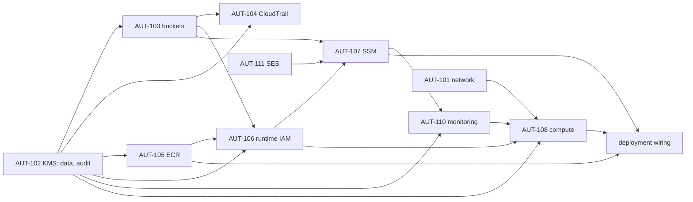

# Consolidated review package: staging platform completion (AUT-102 … AUT-111)

- **For:** one independent integrated review of every module below. Each module gets its own verdict (CERTIFIED,
  CERTIFIED WITH CONDITIONS, NOT CERTIFIED); a finding in one module does not reopen another.
- **Branch:** `infra/staging-platform-completion`, one dependency-ordered commit per module (§2).
- **State:** implementation only. **Nothing is applied, no AWS resource is created, Veda is not deployed and public
  lead intake stays disabled.** Applies stay disabled by the apply gate (OD-B7, N-04-S) and by the decision gate (§3).
- **Base:** `main` after PR #21 (AUT-101 network), AUT-112 (budget) and AUT-301 (plan/apply workflows).
- **Owner decisions of 2026-10-05:** C1 keep the budget alerts (80% and 100% forecast); C2 the bootstrap is re-applied
  before the first AUT-101 apply; C3 VPC flow logs go to S3; C4 the default VPC stays for now.

## 1. Architecture summary

One Graviton host (t4g.small, Amazon Linux 2023) in the AUT-101 public subnet with no inbound access, running the
API, worker, scheduler and Litestream in Docker (02 §12). State lives on an encrypted data volume and replicates to
S3; nightly snapshots and anchors are Object-Locked; every AWS call is audited by CloudTrail; logs and alarms go to
CloudWatch and an SNS topic; email goes through SES in sandbox. The host is managed only through SSM; the image comes
from ECR; configuration comes from SSM parameters; secrets are seeded by the owner (AUT-302), never by Terraform.

## 2. Commits

| # | Commit | AUT | Protected requirements |
|---|---|---|---|
| 1 | KMS | AUT-102 | TG-02 (MFA secrets under a real KMS key), F7 (no cross-account use), region confinement |

## 3. Decisions

`infra/config/staging-platform.json` holds every platform decision. An entry marked `PROPOSED` is a value the owner
has not yet decided: plans run with it, applies refuse it.

| Section | Status | Content |
|---|---|---|
| `kms` | DECIDED | Two keys (data, audit); yearly rotation; 30-day deletion window |

## 4. Modules

### 4.1 AUT-102 KMS (`modules/kms`)

| Item | Implementation |
|---|---|
| Keys | `alias/veda-stg-data`: MFA secret blobs (`VEDA_KMS_KEY_ARN`, TG-02), EBS, Litestream/snapshot/anchor/artifact buckets, ECR. `alias/veda-stg-audit`: CloudTrail, logs and evidence buckets, CloudWatch Logs, the alarm topic |
| Why two, not three | One application key and one storage key would cost 1 USD/month more; the host needs both anyway. Duty separation is kept where it matters: audit data (trail, logs, evidence) is under a key the application does not use for its data |
| Shape | Symmetric `ENCRYPT_DECRYPT`, single-region, rotation every 365 days, 30-day deletion window, `prevent_destroy` |
| Policy | Account root (IAM decides use inside the account); **Deny `kms:*` to any caller outside the account** (`kms:CallerAccount`, AWS service principals excepted); audit key only: CloudWatch Logs for `/veda/staging/*` log groups (encryption context), CloudTrail for the `veda-stg-trail` trail (source ARN and context), log delivery for flow logs (source account and ARN), CloudWatch alarms for the topic (source account) |
| Plan guard | Refuses a key without rotation, a deletion window under 30 days, multi-region, asymmetric or HMAC keys, a lockout-check bypass, an unknown or default policy, a policy without the cross-account Deny, any Allow to another account; replica, external and custom-store keys, a separate `aws_kms_key_policy`, an alias outside `alias/veda-*` |
| Tests | `modules/kms`: 4 (shape and rotation; cross-account Deny; audit-key services bound by conditions; short window refused). `run.sh`: 15 |
