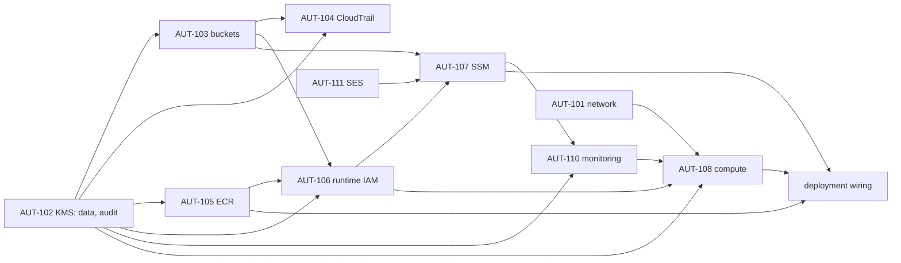

# Consolidated review package: staging platform completion (AUT-102 … AUT-111)

- **For:** one independent integrated review of every module below. Each module gets its own verdict (CERTIFIED,
  CERTIFIED WITH CONDITIONS, NOT CERTIFIED); a finding in one module does not reopen another.
- **Branch:** `infra/staging-platform-completion`, one dependency-ordered commit per module (§2).
- **State:** implementation only. **Nothing is applied, no AWS resource is created, Veda is not deployed and public
  lead intake stays disabled.** Applies stay disabled by the apply gate (OD-B7, N-04-S) and by the decision gate (§3).
- **Base:** `main` after PR #21 (AUT-101 network), AUT-112 (budget) and AUT-301 (plan/apply workflows).
- **Owner decisions of 2026-10-05:** C1 keep the budget alerts (80% and 100% forecast); C2 the bootstrap is re-applied
  before the first AUT-101 apply; C3 VPC flow logs go to S3; C4 the default VPC stays for now.

## 1. Architecture summary

One Graviton host (t4g.small, Amazon Linux 2023) in the AUT-101 public subnet with no inbound access, running the
API, worker, scheduler and Litestream in Docker (02 §12). State lives on an encrypted data volume and replicates to
S3; nightly snapshots and anchors are Object-Locked; every AWS call is audited by CloudTrail; logs and alarms go to
CloudWatch and an SNS topic; email goes through SES in sandbox. The host is managed only through SSM; the image comes
from ECR; configuration comes from SSM parameters; secrets are seeded by the owner (AUT-302), never by Terraform.

## 2. Commits

| # | Commit | AUT | Protected requirements |
|---|---|---|---|
| 1 | KMS | AUT-102 | TG-02 (MFA secrets under a real KMS key), F7 (no cross-account use), region confinement |
| 2 | Buckets and Object Lock; flow logs to S3 (C3) | AUT-103, AUT-101 | OPS-002 (Litestream), RR-14 (snapshots), SEVT-007 and FC-01 (anchors), evidence, F2/F7 (no public or foreign access), N6 |
| 3 | CloudTrail | AUT-104 | F6 (audit cannot be weakened), FC-01 and RR-09 attribution, LOG-* tamper evidence |

## 3. Decisions

`infra/config/staging-platform.json` holds every platform decision. An entry marked `PROPOSED` is a value the owner
has not yet decided: plans run with it, applies refuse it. **Decision gate:** `stack.sh apply` refuses while any
`infra/config/staging-*.json` section has `"status": "PROPOSED"` (checked after the apply gate, before any AWS
session); a malformed decision file also refuses.

| Section | Status | Content |
|---|---|---|
| `kms` | DECIDED | Two keys (data, audit); yearly rotation; 30-day deletion window |
| `storage` | **PROPOSED** | Lifecycle periods; evidence locked in COMPLIANCE mode for 30 days |
| `cloudtrail` | **PROPOSED** | CloudWatch copy 30 days; S3 data events on anchor and evidence added by the owner session |
| `anchor_retention` | **PROPOSED** | D6: the application locks each anchor for **3650 days** in COMPLIANCE mode (`anchor_store.py`); accept, or change the application first |

## 4. Modules

### 4.1 AUT-102 KMS (`modules/kms`)

| Item | Implementation |
|---|---|
| Keys | `alias/veda-stg-data`: MFA secret blobs (`VEDA_KMS_KEY_ARN`, TG-02), EBS, Litestream/snapshot/anchor/artifact buckets, ECR. `alias/veda-stg-audit`: CloudTrail, logs and evidence buckets, CloudWatch Logs, the alarm topic |
| Why two, not three | One application key and one storage key would cost 1 USD/month more; the host needs both anyway. Duty separation is kept where it matters: audit data (trail, logs, evidence) is under a key the application does not use for its data |
| Shape | Symmetric `ENCRYPT_DECRYPT`, single-region, rotation every 365 days, 30-day deletion window, `prevent_destroy` |
| Policy | Account root (IAM decides use inside the account); **Deny `kms:*` to any caller outside the account** (`kms:CallerAccount`, AWS service principals excepted); audit key only: CloudWatch Logs for `/veda/staging/*` log groups (encryption context), CloudTrail for the `veda-stg-trail` trail (source ARN and context), log delivery for flow logs (source account and ARN), CloudWatch alarms for the topic (source account) |
| Plan guard | Refuses a key without rotation, a deletion window under 30 days, multi-region, asymmetric or HMAC keys, a lockout-check bypass, an unknown or default policy, a policy without the cross-account Deny, any Allow to another account; replica, external and custom-store keys, a separate `aws_kms_key_policy`, an alias outside `alias/veda-*` |
| Tests | `modules/kms`: 4 (shape and rotation; cross-account Deny; audit-key services bound by conditions; short window refused). `run.sh`: 15 |

### 4.2 AUT-103 buckets and Object Lock (`modules/storage`)

| Bucket | Key | Lock | Lifecycle (PROPOSED) | Writers |
|---|---|---|---|---|
| `veda-stg-litestream-<acct>` | data | — | noncurrent versions 7 days | Host (Litestream) |
| `veda-stg-snapshots-<acct>` | data | Enabled; the application locks each snapshot 35 days (COMPLIANCE) | expire after 42 days | Host (nightly snapshot) |
| `veda-stg-anchor-<acct>` | data | Enabled; the application locks each anchor **3650 days** (COMPLIANCE) | none | Host (chain anchors) |
| `veda-stg-artifacts-<acct>` | data | — | expire 90 days, noncurrent 30 | `veda-gh-deploy` (bundles) |
| `veda-evidence-<acct>` | audit | **Default COMPLIANCE 30 days** | none | `veda-gh-evidence`, the collector on the host |
| `veda-stg-logs-<acct>` | audit | — | `cloudtrail/` 90 days, `vpc-flow/` 30 days | CloudTrail (the Veda trail), VPC flow-log delivery |

- **Every bucket:** SSE-KMS with a bucket key; versioning; all four public access blocks; `BucketOwnerEnforced`;
  incomplete uploads aborted after 7 days; `prevent_destroy`; a policy that **denies plain HTTP** and **denies every
  principal of another account** (AWS services excepted, each bound by its own statement).
- **Snapshots and anchors:** the policy denies any write without an Object Lock mode, and every delete.
- **Logs:** CloudTrail may write `cloudtrail/AWSLogs/<acct>/` only for the Veda trail (source ARN); flow-log delivery
  may write `vpc-flow/AWSLogs/<acct>/` only for this account's log sources.
- **Names are the bootstrap's:** the deploy role writes only artifacts, the evidence role only evidence; the plan,
  deploy and evidence roles cannot read Litestream, snapshot or anchor objects (`deny_data_reads`).
- **D6, anchor retention (owner decision):** the anchor writer in the application sets a 10-year COMPLIANCE lock
  (`api/veda/platform/anchor_store.py`, `RETENTION`). In staging every anchor, and the bucket, then lives ten years;
  no one, the root user included, can delete them. The infrastructure cannot shorten it. Options: accept it, or a
  reviewed application change making the retention configurable before the first anchor is written.

**AUT-101 change in this commit (owner decision C3):** VPC flow logs go to the logs bucket (`vpc-flow/`, plain text,
hourly partitions) instead of CloudWatch Logs. The flow-log role, its policy and the log group are gone (network: 27
resources), and **the bootstrap line letting `veda-gh-apply` pass roles to `vpc-flow-logs.amazonaws.com` is removed**:
nothing passes a role to flow logs any more. The bootstrap code is again exactly what was applied on 2026-10-04, so the
re-apply of C2 would plan **no changes**; it stays in the apply sequence only as a verification step.

**Plan guard:** every bucket created with a name (not an unknown id) and, in the same plan and naming it, all four
public access blocks, `BucketOwnerEnforced`, versioning, SSE-KMS and a TLS-only policy; refused: bucket ACLs, a block
with a setting off, other ownership, suspended versioning, SSE-S3, a GOVERNANCE or over-a-year default lock,
replication, website, CORS, access points, Multi-Region Access Points and Transfer Acceleration (the last two bypass
the S3 endpoint policy, AUT-101 review m6).

**Tests:** `modules/storage`: 7 (the six bootstrap names; locks; private, encrypted, versioned; TLS-only and
account-only policies with each statement on its own bucket; evidence lock; GOVERNANCE, early snapshot expiry and
foreign names refused). `run.sh`: 30, starting from a real sandboxed plan of the storage module (each check removes or
changes one thing), plus the decision gate (committed decisions refuse; recorded decisions pass; malformed file
refuses).

### 4.3 AUT-104 CloudTrail (`modules/cloudtrail`)

| Item | Implementation |
|---|---|
| Trail | `veda-stg-trail`: multi-region, global service events, **log-file validation**, logging on, audit key; S3 copy in the logs bucket under `cloudtrail/` (kept per `storage.logs_cloudtrail_expire_days`); `prevent_destroy` |
| CloudWatch copy | `/veda/staging/cloudtrail`, audit key, 30 days; delivered by `veda-stg-cloudtrail-logs` (bounded, assumable by CloudTrail only for this trail, writes only that group's streams) |
| Tampering metric | `Veda/Audit AuditTampering`: StopLogging, DeleteTrail, UpdateTrail, Put*Selectors; ScheduleKeyDeletion, DisableKey, PutKeyPolicy; PutBucketPolicy, DeleteBucketPolicy, Put/DeleteBucketPublicAccessBlock, PutObjectLockConfiguration. Alarm in AUT-110. Delivery failure: AWS/Logs `IncomingLogEvents` on the group (alarm in AUT-110) |
| Boundary interplay | `veda-boundary` denies every role `StopLogging`, `DeleteTrail`, `UpdateTrail` and `Put*Selectors`. The trail is therefore created with management events only and can never be stopped or re-scoped by a workflow. **Any later change to the trail is an owner-session task.** The S3 data events on the anchor and evidence buckets (FC-01, RR-09) are added once by the owner session after the first apply (runbook) |
| Plan guard | Refuses a trail that is single-region, omits global events or log-file validation, is created with logging off, has no KMS key, writes outside a `veda-*` bucket, or sets any selector; CloudTrail Lake data stores and channels; a log group outside `/veda/`, without a KMS key or kept forever |
| Tests | `modules/cloudtrail`: 3 (trail settings and no selectors; CloudWatch copy and bounded delivery role, all values visible at plan time; tampering pattern). `run.sh`: 16, from a real sandboxed plan of the module |

